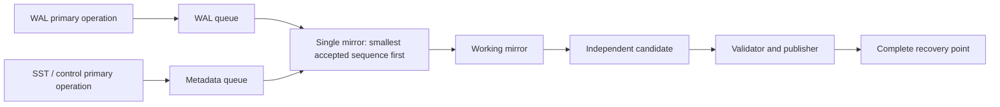

# WAL and metadata channels

The production backup now owns two `Channel` objects: WAL, and metadata (SST,
MANIFEST, CURRENT, OPTIONS, IDENTITY and temporary files). Each owns its primary
operation mutex, event queue, capacity condition variable and waiting charge.
This makes the ownership boundary explicit rather than attaching two operation
mutexes to one undifferentiated queue.



Both queues share a short coordination mutex and one capacity budget (64 MiB
by default), including reservations, queued events and the event being applied.
Workers never acquire primary operation mutexes. Capacity waiting releases the
coordination mutex but retains the caller's channel operation mutex. Thus a
large blocked SST reservation permits a smaller WAL reservation if the shared
budget has room. There is no guaranteed WAL allocation, priority or starvation
bound. Primary I/O and payload copying remain on the producer path.

A successful primary operation receives a sequence when enqueued under the
coordination mutex. Each channel is FIFO; comparing the two heads reproduces
the global accepted order. The mirror fixes a finite accepted boundary for
each drain/capture cycle, so continuous producers cannot extend that cycle
forever. Cross-channel rename locks both operation mutexes with deadlock-safe
locking and emits one metadata event. Native RocksDB file dependencies remain
ordered; immutable SST pinning, complete WAL/MANIFEST validation and atomic
point publication are unchanged. No public DB API or backup-format change is
introduced. `db_bench` uses the channels through its existing Metabypass entry.

Error cleanup subtracts queued charges only. An outstanding primary operation
still owns its reservation and releases it on completion; it cannot enqueue
after failure or stopping. This avoids unsigned underflow and late orphaned
events. Normal wrapper Close remains exclusive: it closes the primary DB before
stopping backup workers. Internal stop tests exercise waking blocked producers,
not support for concurrent application-level Close.

## Coverage

Eight channel tests supplement the existing 26 tests:

- WAL progresses while an SST primary operation is held, and while a larger
  SST capacity reservation waits.
- Both channel waiters wake on failure and on stopping.
- Both waiters compete for capacity that cannot accommodate both together.
- Interleaved appends, close, cross/same-channel rename, reopen, deletion and
  creation preserve the exact global applied sequence and mirrored bytes.
- Failure while a primary operation holds a reservation retains that charge
  until completion and then releases it without enqueueing.
- Metadata-only traffic drains on the interval timer.

Synchronization uses explicit gates and sync points, not sleep-based ordering.
Existing tests also cover concurrent WriteBatch/flush/sync, rotations,
compaction, validation/publication failure, unflushed blobs and SIGKILL recovery.

## Measurement protocol

The comparison uses `current` (notification optimization, revision `bbd60f2ca`),
`split` (historical two-operation-lock/single-queue experiment), and `channels`
(the formal implementation). Five rotated trials per version and workload,
plus warmups: 100,000 writes with 1 KiB values, WAL enabled, `sync=false`.
The default workload has a 64 MiB budget; mixed adds concurrent flush/compaction;
pressure uses mixed with a 2 MiB budget. Report foreground, explicit sync,
close and their sum separately, plus Put latency, capacity waits, queue peak,
point lag, space and restore time. This is a directory experiment on the same
VM, not a Ceph performance comparison or a real power-loss guarantee.

The runner removes the entire primary index after every successful run,
restores using the old `current` reader, verifies every key, appends and reopens.
It also kills each writer after confirmed SyncBackup and performs the same
recovery. Historical scripts and results live in
[the scheduling experiment](scheduling-ab.md); `build.py` now defaults to the
pinned historical source rather than applying old textual transforms to the
changing production tree. Build the formal variant with:

```sh
python3 docs/components/metabypass/experiments/scheduling-ab/channels.py \
  --library /tmp/metabypass-release-build/librocksdb.a \
  --out /tmp/mb-channels-ab --trials 5 --output /tmp/mb-channels-results.json
```

## Test results

Normal and `ASSERT_STATUS_CHECKED` component runs each passed **34/34**.
`COERCE_CONTEXT_SWITCH=1` repeated the whole suite 100 times: **3400/3400**
passed, with a 60-second limit per test child. The release `db_bench` build and
10,000-key write / whole-index deletion / restore / verification smoke passed.
Raw commands, source hashes, log hashes and failure output are in
[`channel-checks.json`](experiments/channel-checks.json).

The required full checks were executed with 24 test jobs and a `timeout 60`
child driver. They are **not all green**:

| Build | Completed shards | Failed shards |
|---|---:|---:|
| Normal | 3322 | 8 |
| Status checked | 3303 | 6 |

Both runs reproduce two existing BloomFilter assertions (8.248 bits/key versus
7 +/- 0.3), and the existing Prefetch assertion (1.319 MB versus at least 1.887
MB), followed by a cleanup segmentation fault. Normal also has five timeout
shards: compaction (one), external SST ingestion (two) and column family (two).
Status checked has three: compaction (one) and column family (two).
These are a subset of the previously recorded
[notification-check failures](notification-validation.md). The seven historical
timeout cases passed separately on fresh tmpfs directories in **both** builds
(7/7 each), still limited to 60 seconds per child. This does not turn the full
runs into passes.

Source checks, BUCK consistency, formatting, Python checks, ldb tests,
db_crashtest tests and dump tests passed. Workflow YAML checking remains blocked
by the absent Ruby executable. C API compatibility checking still reports the
pre-existing 21 functions and five public symbols missing relative to `main`;
this change does not modify public headers. No new production translation unit
or build-system source list was needed. Validation was on Linux/GCC; other
platforms and sanitizer builds were not run.

## Performance results

Five-trial medians follow. Times are milliseconds; Put p99 is microseconds.
Total is the median of each run's foreground + sync + close sum, excluding Open
and recovery. Raw samples, ranges and binary fingerprints are in
[`channel-results.json`](experiments/channel-results.json).

| Workload | Version | Foreground ms | Sync ms | Close ms | Total ms | Put p99 us |
|---|---|---:|---:|---:|---:|---:|
| default | current | 832.963 | 347.640 | 627.381 | 1865.717 | 19.884 |
| default | split | 838.637 | 349.700 | 638.928 | 1868.923 | 20.249 |
| default | channels | 854.592 | 307.977 | 627.086 | 1789.736 | 19.572 |
| mixed | current | 2212.807 | 510.964 | 107.047 | 2817.876 | 36.966 |
| mixed | split | 2217.205 | 467.292 | 113.555 | 2836.512 | 33.009 |
| mixed | channels | 2166.177 | 496.957 | 113.882 | 2754.613 | 31.489 |
| pressure | current | 2214.366 | 509.481 | 113.960 | 2802.218 | 37.656 |
| pressure | split | 2230.996 | 531.038 | 110.616 | 2804.406 | 35.736 |
| pressure | channels | 2222.867 | 480.438 | 111.333 | 2792.371 | 34.013 |

Relative to notification-only `current`, channels reduce mixed Put p99 by
**14.8%** and pressure p99 by **9.7%**. Relative to experimental `split`, those
reductions are **4.6%** and **4.8%**. Mixed foreground decreases 2.1% versus
current (2.3% versus split); pressure foreground changes +0.4% versus current
(-0.4% versus split). These small aggregate differences have overlapping ranges;
the clearer result is mixed-workload p99, not a large throughput improvement.

Default foreground is **2.6% higher** than current (1.9% higher than split),
with overlapping ranges: current 824--899 ms, channels 841--912 ms. Default has
no flush or compaction completed in the foreground, so there is little SST
operation-lock contention to remove. This experiment does not isolate the
cause of the small difference and does not establish a universal speedup.

Every measured mixed/pressure run completed 63 flushes and 63--64 compactions
during the foreground. Default/mixed capacity waits were zero in all three versions.
Pressure median waits were current 0, split 0.662 ms, channels 0; channels still
waited 14.449 ms and 12.949 ms in two trials. Thus a zero median does not mean
backpressure was eliminated. Pressure channels also had one slower 2964 ms
foreground run with a 111.6 ms maximum Put, despite a 34.4 us p99; this outlier
is retained in the raw data and prompted a separate follow-up below.

Restore medians (default / mixed / pressure) were current 1175 / 1922 / 1948 ms,
split 1178 / 1910 / 1962 ms, channels 1175 / 1912 / 1926 ms. Queue peaks,
last-point lag, mirrored bytes, CPU and context-switch counters are preserved
per run. Restore cost remains broadly similar; no recovery-format change was
introduced.

All **57 recovery pairs** passed: 45 measured writes, nine warmups and three
post-Sync SIGKILL writers. Every recovery used the old notification reader after
removing the entire primary index and verified content, additional writes and
reopen. The separate db_bench smoke also passed. These checks do not simulate
storage losing unsynced writes after real power failure.

### Pressure follow-up

A separate five-trial pressure-only comparison investigated the slow original
channel run without replacing the first series. Command:

```sh
python3 docs/components/metabypass/experiments/scheduling-ab/run.py \
  --binaries /tmp/mb-channels-ab --variants current,split,channels \
  --cases pressure --trials 5 --output /tmp/mb-channels-pressure-followup.json
```

| Version | Foreground median (range), ms | Put p99 median, us | Largest Put across trials, ms | Total median, ms |
|---|---:|---:|---:|---:|
| current | 2160.449 (2154.623--2613.316) | 37.722 | 41.617 | 2794.577 |
| split | 2190.465 (2165.668--2325.430) | 34.073 | 33.506 | 2852.483 |
| channels | 2179.029 (2174.004--2269.182) | 34.227 | 43.122 | 2782.374 |

Channels retain a **9.3% p99 reduction versus current**, with foreground +0.9%
and total -0.4%. Against split, p99 is +0.5%, foreground -0.5% and total -2.5%:
this does **not** establish a consistent extra p99 gain from splitting the queue
itself. The primary benefit versus the single-operation-lock version remains
lock isolation; the explicit channels improve ownership and maintainability.

The 111.6 ms Put and 2964 ms channel foreground outlier did not recur, but its
cause was not isolated. The follow-up still has long Puts in all versions and
capacity waits (channels median 7.429 ms, maximum 14.206 ms). Do not infer a
worst-case latency guarantee or absence of backpressure. Raw results are in
[`channel-pressure-followup.json`](experiments/channel-pressure-followup.json).
Its **21 recovery pairs** all passed (15 measured, three warmups, three SIGKILL),
bringing the two series to **78/78** successful recovery pairs, plus the separate
db_bench smoke.

For the fresh four-version comparison including backup disabled, see
[channels versus no backup](channel-baseline-comparison.md).
