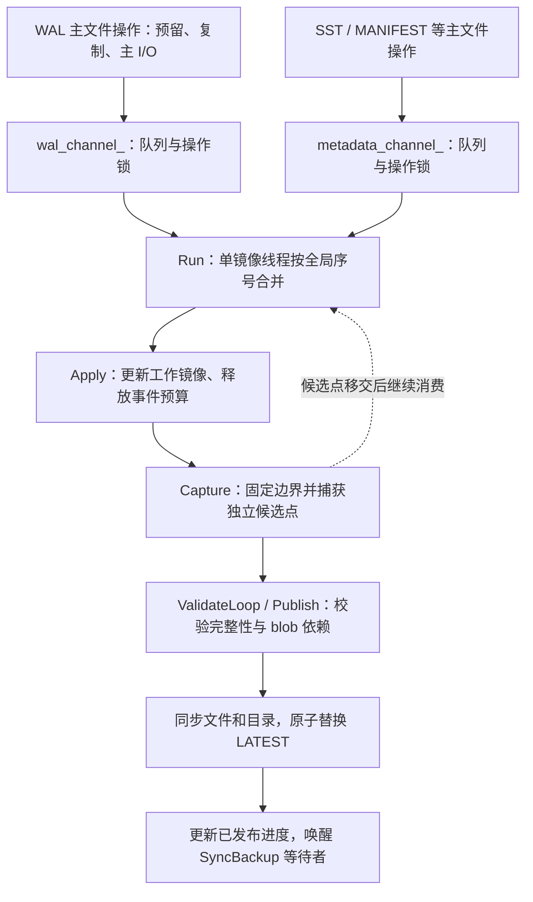

# Metabypass 优化实现、执行链路与测试报告

更新日期：2026-09-20。本文汇总目前已实现的架构、可靠性与性能改进，并说明优化所在的执行链路和对应测试证据。性能对比中的“原始版”指迁移后的串行 Metabypass；“无备份基线”同样使用分离式 Blob Direct Write，只关闭备份。未对原 Ceph 实现做同条件性能测量。

阅读入口：[执行链路与源码位置](#7-执行链路与源码位置)、[最新无备份对照](#8-最新无备份基线对照)、[测试报告索引](#9-测试报告与原始数据索引)。

## 1. 初版架构与可靠性改进

| 改进 | 解决的问题 | 实现原理 |
|---|---|---|
| 分离存储与备份拆成独立模块 | blob 生命周期与索引备份耦合，难以独立维护 | `SeparatedStorage` 管理 blob，`Backup` 管理索引镜像，薄 `MetaBypassDB` 组合生命周期，不修改 DB 公共虚函数接口。 |
| 直接备份原生索引文件 | 自定义持久化操作日志增加写入及恢复流程 | 通过文件系统包装器捕获成功操作，内存队列驱动 SST、WAL、MANIFEST 等原生文件镜像；恢复走 RocksDB 原生流程，无自定义操作日志重放。 |
| 只备份索引，不重复复制 value | 大 value 随备份重复搬运 | value 由 Blob Direct Write 写入独立目录；发布前按文件和有效长度确认依赖已持久化，不强制 flush 活跃 memtable/blob 状态。 |
| 有界队列与预留容量 | 旁路变慢时内存无限增长，或主操作完成后才发现无法入队 | 主文件操作前预留容量，在途事件也计费；容量不足施加背压，默认上限 64 MiB。 |
| 工作镜像与完整恢复点分离 | 镜像可能停在半条 WAL、半组 MANIFEST 编辑或不完整依赖上 | 候选点截取完整记录/编辑组，确认 SST 与 blob 依赖；同步文件和目录后原子替换 `LATEST`，保留最新及前一个点。 |
| SST 复用，可变文件独立复制 | 全量复制成本高，共享可变文件又会破坏旧点 | 已封闭 SST 在旁路内硬链接复用，不支持时复制；WAL、MANIFEST 使用独立限长副本。 |
| 未 flush blob 的恢复与重试 | WAL 中的 blob 引用尚未登记，恢复 SST 时可能缺失元数据或复用文件编号 | 原生恢复前校验并登记引用，推进文件编号；需要封口时先校验，再经同步临时文件原子替换，支持中断重试。保留全部 blob，防止旧点引用失效。 |
| 失败传播与关闭排空 | 备份已失败但前台继续写，或关闭丢下未完成事件 | 错误保持并唤醒等待者，拒绝新写入、保留读取；Sync/Close 返回错误。正常关闭先关闭主 DB，再排空并发布最终点。 |

## 2. 双阶段流水线与增量校验

| 优化 | 解决的问题 | 实现原理 |
|---|---|---|
| 镜像与校验使用两个后台线程 | 校验耗时期间无人消费队列，造成前台背压 | 镜像线程捕获独立候选点后继续消费；校验线程独立验证并发布。Sync 等待已发布覆盖范围，而非仅等待镜像完成。 |
| 限制候选点并固定 SST 引用 | 并行后候选目录无限增长，或文件删除与校验冲突 | 同时最多一个捕获/校验中的候选点；固定其 SST 生命周期，使工作镜像删除不影响候选点。 |
| 隔离队列锁与发布锁 | 慢 I/O、blob 持久化或发布操作拖住前台 | 队列锁不跨备份 I/O 和 blob 持久化；独立发布锁协调错误与指针提交，成功的前台生产路径不获取发布锁。 |
| SST 校验缓存 | 每个恢复点反复扫描未变化 SST | 按文件身份、代次和大小复用已验证引用及校验和；新 SST 仍完整验证引用。 |
| WAL 引用校验缓存 | 反复验证旧 WAL 记录指向的 blob payload | 记录已检查的完整记录及依赖；仍解析原生 WAL 并检查记录校验和，跳过旧记录重复的 blob 内容校验。 |
| blob 前缀增量校验 | 每次从头读取越来越长的 blob | 保留已验证边界、记录数与 CRC，仅扩展到新增完整记录及 footer；依赖仍同步，请求更短前缀时重新计算。 |
| 索引清单 CRC 增量计算 | 生成 INVENTORY 时重复读取追加文件旧内容 | 从缓存 CRC 延伸计算新增字节；创建、截断、重命名使缓存身份失效，消失的索引项被清理，重启清空缓存。 |

这里的“增量”是减少重复校验，**不是分批发布不完整恢复点**。离线恢复仍完整校验原生索引文件和所需 blob 前缀；备份格式保持兼容。缓存依赖文件独占、SST 不变和 blob 追加写，旧内容的潜在介质损坏可能到恢复时才被发现。

## 3. 队列通知与调度优化

| 优化 | 解决的问题 | 实现原理 |
|---|---|---|
| 四类等待分离、定向唤醒 | 逐事件广播导致无效唤醒、抢锁和线程切换 | 镜像、校验、容量和同步进度分别使用条件变量；仅在镜像等待且工作条件满足时通知，候选移交才通知校验线程。 |
| 批量/定时触发 | 小事件频繁唤醒后台，放大前台开销 | 正常流量按默认 256 KiB 或 1000 ms 触发；显式 Sync 主动请求处理。 |
| 容量不足立即排空 | 队列尚未达到批量阈值，但下一事件已放不下，只能等定时器 | 阻塞的容量预留立即请求镜像消费；消费后仅在足够容纳等待事件时通知生产者。 |
| 完善同步、失败和退出唤醒 | 定向通知可能遗漏多个 Sync 调用者或关闭中的线程 | 发布后唤醒所有 Sync 等待者，各自检查目标；失败、关闭、校验完成与镜像退出通知相关等待方。 |

此前“双线程＋增量校验”使默认队列下前台变慢，主要原因是通知广播和锁竞争增加，而默认队列本来几乎没有背压可消除。小队列原本背压明显，因此更快排空的收益能抵消调度开销。当前通知优化针对的就是这部分前台回退。

## 4. 通知优化阶段性能结果

同机、单写线程、1 KiB value、WAL 开启、`sync=false`，每组五次取中位数。默认队列下写入 20 万条，单位为秒：

| 版本 | 前台写入 | 写入＋备份同步＋关闭 |
|---|---:|---:|
| Blob Direct Write，无备份 | 1.450 | 1.839 |
| 原始 Metabypass：串行＋全量校验 | 1.759 | 6.425 |
| 双线程＋增量校验，未优化通知 | 2.406 | 3.681 |
| 通知版：双线程＋增量校验＋通知优化 | 1.711 | 3.233 |

- 通知版相比原始版：总耗时降低 **49.7%**；前台名义降低 2.7%，测量范围重叠，视为接近。
- 通知版相比未优化通知版：前台耗时降低 **28.9%**，总耗时降低 **12.2%**。显式同步阶段有所变长，已计入总耗时。
- 通知版相比无备份：前台仍增加 **18.0%**，总耗时增加 **75.8%**，这是当前配置下生成完整备份的成本。
- 2 MiB 小队列、5 万条写入：相比原始版，前台耗时降低 **42.9%**、总耗时降低 **48.1%**；观测容量背压从约 **319 ms 降为 0**，不代表所有负载都无背压。

总耗时取每次运行总和的中位数，不含 Open；上述结果仅代表当前虚拟机及共享 ext4 目录实验。详见[四版本性能对比](version-comparison.md)。

## 5. 验证与保留的边界

- 通知优化相关测试：普通及 Status 检查构建各 **26/26**，强制线程切换重复测试 **2600/2600**；性能对比中 **45 次主索引删除后恢复及全量内容核验全部通过**。
- 仓库全量检查仍有已记录的断言失败与超时，不能表述为全量通过，详见[通知优化验证记录](notification-validation.md)。这里是通知优化阶段的验证结果；双通道新增结果见第 6 节。
- 仍需复制可变文件、解析 WAL/MANIFEST；镜像 I/O 阻塞仍可触发背压。仅支持单 CF 科研范围，不保证固定 RPO，全部保留 blob 会持续占用空间，目录级 SIGKILL 不等同真实掉电验证。
- 实验中“直接移除内容扫描”的消融版本未作为正式优化采用；正式版本保留必要校验及完整点发布协议。

更多细节：[模块说明](index.md)、[流水线与增量校验](pipeline-validation.md)、[前台回退定位](foreground-profile.md)。

## 6. WAL 与其他元数据分通道

| 优化 | 解决的问题 | 实现原理 |
|---|---|---|
| WAL / metadata 两个通道 | 单个操作锁让 WAL 等待 SST 主写入；只拆锁又不直观 | 每个通道封装操作锁、队列、容量条件变量及等待量，WAL 与 SST/MANIFEST 等独立串行。 |
| 全局序号合并 | 分队列可能破坏创建、追加、重命名、删除和恢复点边界 | 一个镜像线程比较两个队首序号，按成功接收顺序消费；跨通道重命名获取两把操作锁。 |
| 共享总预算与按需唤醒 | 两条队列可能让内存上限翻倍或遗漏等待者 | 保留共享 64 MiB，总计预留、排队及消费中事件；按各通道需要的容量唤醒并重新检查。 |
| 保留在途预留量 | 后台失败清空计数时，未完成的主操作仍会释放容量，可能下溢 | 后台只释放已排队事件；在途生产者完成后释放自己的预留量，失败/停止后不再入队。 |

本次未引入 WAL 优先级、容量保留或额外镜像线程。减少的是跨类别主操作锁等待，payload 复制、共享协调锁、主 WAL I/O 和总容量背压仍在前台路径。最新测试及三版本性能对照见[双通道验证记录](channel-validation.md)。

双通道验证：普通/Status 构建各 **34/34**，强制线程切换重复 **3400/3400** 通过。仓库全量检查分别完成 3322/3303 个分片，有 8/6 个历史已知失败或超时，未宣称全量通过；七个历史超时用例在独立 tmpfs 目录重跑，两种构建各 **7/7** 通过。

五轮交错测试中，双通道相比通知版：混合负载 Put p99 **降低 14.8%**，2 MiB 队列负载 **降低 9.7%**；相比分锁实验版分别降低 **4.6% / 4.8%**。前台总耗时整体接近，默认负载中位数反而增加 **2.6%**，不能解释为所有场景的吞吐提升。原始范围、单次长延迟及后续复测均保留在验证报告中。

小队列追加五轮复测：相对通知版 p99 仍降低 **9.3%**；相比分锁版则约 **+0.5%**，因此不能把队列拆分本身描述为稳定的额外加速。主要性能收益来自操作锁隔离，显式通道的额外价值是职责清晰和维护便利。两轮实验共 **78/78** 次删除主索引后的恢复核验通过（含六次 SIGKILL），另有 db_bench 接入验证通过。

## 7. 执行链路与源码位置

### 7.1 前台 Put / WriteBatch：额外开销发生在哪里

无备份基线保留 `SeparatedStorage`，通过 RocksDB 原生写入路径写 blob、WAL 和 memtable。当前版本在其上增加入口校验和索引文件操作拦截。一次 Put 不一定对应一次文件 Append；下面展开的是实际触发索引 Append 时的路径。

| 步骤 | 当前实现 | 对前台的影响及优化位置 |
|---|---|---|
| 入口 | `MetaBypassDB::Put -> Write`：构建 WriteBatch，遍历检查支持范围，检查 WAL 配置和备份错误 | 检查在调用线程执行，错误查询需要短暂获取共享锁。 |
| 原生写入 | `DB::Write` 执行 Blob Direct Write 和 RocksDB 原生写入协议 | value 进入独立 blob 目录；备份模块不复制 blob payload。此处省略引擎内部细节，不改变其写入顺序。 |
| 选择通道 | 创建可写文件时选择 WAL 或 metadata，`MirrorWriter` 保存通道引用 | Append 获取所属通道的 `operations` 锁。SST 主操作不再持有 WAL 的操作锁；同通道操作仍串行。 |
| 容量预留 | `Reserve(channel, charge)` 在共享 `mutex_` 下检查错误、停止状态和总预算 | 满额时等待该通道的容量条件变量，释放共享锁但保留通道操作锁；计费包含预留、排队及后台正在消费的事件。 |
| 复制与主写入 | 将本次索引字节复制到事件，再调用底层文件的 `Append` | 内存分配/复制和主文件 I/O 都发生在生产者路径，必须完成后才能继续；双通道没有消除这部分开销。 |
| 成功入队 | `Finish` 在共享锁下分配全局序号，移动事件到对应队列 | 保证同通道顺序及全局合并顺序；只有主操作成功且备份未失败/停止时才入队。 |
| 按需通知与返回 | `WakeMirror` 检查镜像是否等待、处理条件是否满足 | 避免每个事件广播；普通异步写入不直接等待恢复点发布。返回前仍须完成 RocksDB 原生写入流程。 |

因此“后台异步备份”不等于“前台零开销”。复制、预留、入口检查、锁获取仍在 Put 的关键路径上。后台 I/O 与前台争用 CPU/磁盘，或队列满后的背压，也会间接增加 Put 耗时。`WriteOptions::sync=true` 还会引入原生写入同步等待；本报告性能测试使用 `sync=false`。

### 7.2 镜像、候选点、校验与发布

两个通道共享默认 **64 MiB** 总预算；没有为 WAL 保留额度，也没有 WAL 优先消费。`Run` 比较两个队首的全局序号，处理一个固定的已接收边界，避免持续入队无限延长本轮处理。跨通道重命名同时获取两把操作锁，作为一个有序控制事件入队。

`Capture` 仍由镜像线程执行：封闭 SST 优先在旁路内硬链接复用，WAL/MANIFEST 等可变文件独立限长复制。同时最多一个捕获/校验中的候选点。因此，**校验线程阻塞时镜像可以继续消费，但镜像 I/O 或候选复制阻塞时，镜像本身不能继续消费**，队列仍可能满。

`ValidateLoop` 调用 `Publish`，确认原生 WAL 完整记录、MANIFEST 完整编辑组、SST 和 blob 依赖。SST/WAL/blob/索引校验和缓存减少重复校验；必要的完整性检查、依赖持久化和发布顺序仍保留。文件及目录同步完成后原子替换 `LATEST`，保留最新和前一个完整恢复点。不会因发布恢复点周期性强制 flush 活跃 Blob Direct Write 状态。

### 7.3 SyncBackup、关闭与恢复

| 流程 | 调用链 | 等待边界 |
|---|---|---|
| 显式同步 | `MetaBypassDB::SyncBackup -> Backup::Sync`，记录调用时 `accepted_` 为目标，更新 `requested_` 并通知镜像 | 等待 `published_` 覆盖目标；仅入队、镜像写完或候选复制完成都不够。发生备份错误时返回错误。 |
| 正常关闭 | `MetaBypassDB::Close -> DB::Close -> 销毁主 DB -> Backup::Stop` | 主 DB 关闭产生的索引操作先进入队列，再排空、校验并发布最终点，最后加入两个后台线程；关闭是同步等待。应用层不支持并发 Close。 |
| 离线恢复 | `MetaBypassDB::Restore -> 校验已发布点并复制原生索引 -> SeparatedStorage::PrepareRecovery -> 后续 Open 执行 RocksDB 原生恢复` | 校验/登记未 flush 的 blob 引用，必要修整与封口由分离存储模块完成；不重放自定义持久化操作日志。 |

前台 Put、显式 SyncBackup、Close **分别处于各自调用的关键路径**。普通 Put 不直接等待发布；如果应用每次写入后立即 SyncBackup，那么备份完成时间也进入应用每次操作的关键路径。

失败时停止发布、唤醒等待者并拒绝后续写入；已在途主操作可能完成。后台只释放排队事件的预算，在途生产者完成后释放自己的预留，避免计数下溢或错误后继续入队。读能力保留，Sync/Close 返回备份错误。

### 7.4 实现落点

| 文件 | 主要符号与职责 |
|---|---|
| [metabypass_db.cc](../../../utilities/metabypass/metabypass_db.cc) | `Put`、`Write`、`SyncBackup`、`Close`、`Restore`：薄入口、范围检查和生命周期。 |
| [backup.h](../../../utilities/metabypass/backup.h) | `Channel`、`wal_channel_`、`metadata_channel_`、候选点及校验缓存：状态与锁的归属。 |
| [backup.cc](../../../utilities/metabypass/backup.cc) | `MirrorWriter`、`Reserve`、`Finish`、`NextChannel`、`Run`、`Capture`、`Publish`、`WakeMirror`、`WakeCapacity`：生产、调度、镜像及发布。 |
| [separated_storage.cc](../../../utilities/metabypass/separated_storage.cc) | blob 路径与生命周期、`Dependencies`、`PersistIncremental`、`PrepareRecovery`：依赖验证和恢复准备。 |
| [native_files.cc](../../../utilities/metabypass/native_files.cc) | `Inspect` 等原生索引解析、文件复制及校验辅助。 |
| [metabypass_test.cc](../../../utilities/metabypass/metabypass_test.cc) | 34 个组件测试，包括双通道隔离、顺序、容量、失败、退出和恢复验证。 |
| [db_bench_tool.cc](../../../tools/db_bench_tool.cc) | `RunMetaBypassBenchmark`：无备份、写入、恢复、核验模式及阶段指标。 |

## 8. 最新无备份基线对照

下面取自**新一轮四版本交错测试**：每组 10 万条、1 KiB value、单写线程、WAL 开启、`sync=false`，五轮取中位数。无备份版仍使用相同 Blob Direct Write 和分离存储，只移除 Backup 模块。与第 4 节的 20 万条历史数据不是同一组实验，不混算百分比。

| 负载 | 无备份前台 ms | 双通道前台 ms | 前台额外耗时 | 无备份总耗时 ms | 双通道总耗时 ms | 总额外耗时 |
|---|---:|---:|---:|---:|---:|---:|
| 默认，64 MiB | 741.744 | 843.027 | +13.7% | 944.893 | 1775.714 | +87.9% |
| 并发 flush/compaction，64 MiB | 1986.457 | 2196.186 | +10.6% | 2015.032 | 2772.633 | +37.6% |
| 并发 flush/compaction，2 MiB | 1990.346 | 2187.028 | +9.9% | 2021.083 | 2782.373 | +37.7% |

“总耗时”是各轮前台＋显式备份同步＋关闭之和的中位数，不含 Open。无备份版不生成完整恢复点，所以该比值表示增加备份服务的成本，不代表两者提供相同的恢复保障。无备份版没有队列，后两行只是相同原生配置的独立测量。

完整的无备份、通知版、分锁版、双通道版数据，包括 Put p99、样本范围、方法和限制，见[最新四版本测试报告](channel-baseline-comparison.md)及其[原始结果](experiments/channel-no-backup-results.json)。当前主要收益是减少混合负载下的跨类别操作锁等待；没有证据说明拆队列本身相比分锁版稳定加速，也不能把约 10%–14% 的前台额外耗时称为已经消除备份开销。

## 9. 测试报告与原始数据索引

下表按验证范围链接到报告；不同轮次的性能数字不拼成一组。恢复次数含各报告明确列出的预热和崩溃用例，不能全部当作性能采样次数。

| 验证范围 | Markdown 测试报告 | 原始数据 / 复现材料 | 已记录结果 |
|---|---|---|---|
| 双阶段流水线与增量校验 | [流水线与增量校验报告](pipeline-validation.md) | 报告内的命令及实验链接 | 解释候选固定、校验缓存、并发与恢复验证。 |
| 通知优化与历史四版本比较 | [通知优化验证](notification-validation.md)、[历史性能对比](version-comparison.md) | [通知检查记录](experiments/notification-checks.json) | 历史普通/Status 各 26/26，强制切换 2600/2600；历史性能数据使用独立的写入规模。 |
| WAL/SST 锁与优先级取舍 | [调度实验报告](scheduling-ab.md) | [实验说明与脚本](experiments/scheduling-ab/README.md) | 比较分锁、容量预留、优先级方案；正式版本采用双通道，未采用 WAL 优先级或额度保留。 |
| 正式双通道正确性及全量检查 | [双通道验证报告](channel-validation.md) | [测试命令、日志摘要及源码哈希](experiments/channel-checks.json) | 普通/Status 各 34/34，强制切换 3400/3400；全量 3322/3303 分片中有 8/6 个历史失败或超时。 |
| 正式三版本性能与小队列复测 | [三版本及复测报告](channel-validation.md#performance-results) | [首轮结果](experiments/channel-results.json)、[小队列复测](experiments/channel-pressure-followup.json) | 两轮 78/78 次删除主索引后的恢复验证通过，含六次 SIGKILL；额外 db_bench 接入验证通过。 |
| 最新无备份四版本补测 | [无备份基线对照报告](channel-baseline-comparison.md) | [四版本原始结果](experiments/channel-no-backup-results.json)、[补测脚本](experiments/scheduling-ab/no_backup.py) | 60 组正式测量；备份恢复 57/57、无备份主库核验 18/18 通过。无备份核验保留主索引，不能计作丢失主索引后的恢复。 |

全量检查仍有已记录的 BloomFilter/Prefetch 断言失败及超时；七个历史易超时用例在独立 tmpfs 目录重跑，普通/Status 各 7/7 通过，但不将全量结果改写为通过。工作流 YAML 检查缺少 Ruby，C API 相对 `main` 的历史兼容性差异仍存在。详细错误签名和限制见[双通道验证报告](channel-validation.md#test-results)。

本次仅整理文档、源码落点和已有测试证据，未重新运行性能或全量测试。既有结果来自 Linux/GCC 虚拟机目录实验，不等同 Ceph 同条件实测、跨平台验证或真实掉电保证。
